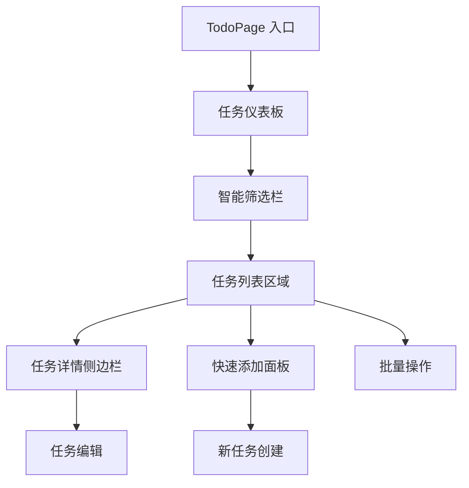

# TodoPage 模块重新设计规范文档

## 1. 产品概述

本文档详细规划了TodoPage模块的全面重新设计，旨在提供现代化、直观且高效的任务管理体验。重新设计将专注于改善用户界面、增强功能性、优化用户体验，并确保在所有设备上的完美响应式表现。

## 2. 现有功能分析

### 2.1 当前功能模块
- **任务列表展示**：基础的任务显示功能
- **筛选和搜索**：按状态、优先级、分类筛选
- **任务统计**：基本的数据统计展示
- **任务表单**：添加和编辑任务的对话框
- **响应式支持**：基础的移动端适配

### 2.2 识别的问题和改进机会
- **视觉层次不够清晰**：缺乏现代化的卡片设计和视觉引导
- **交互体验单一**：缺少拖拽、批量操作等高级交互
- **移动端体验不佳**：布局和交互未充分优化
- **功能分散**：快速操作和批量管理功能缺失
- **视觉反馈不足**：缺少动画和状态反馈

## 3. 核心功能重新设计

### 3.1 用户角色
| 角色 | 描述 | 核心权限 |
|------|------|----------|
| 普通用户 | 个人任务管理者 | 创建、编辑、删除、完成任务，设置优先级和分类 |

### 3.2 功能模块

我们的重新设计包含以下主要页面和模块：

1. **任务仪表板**：统计卡片、快速操作面板、今日焦点
2. **智能筛选栏**：高级搜索、快速筛选标签、排序选项
3. **任务列表区域**：现代化卡片布局、拖拽排序、批量选择
4. **快速添加面板**：浮动添加按钮、快速输入模式
5. **任务详情侧边栏**：详细信息展示、快速编辑

### 3.3 页面详细设计

| 页面名称 | 模块名称 | 功能描述 |
|----------|----------|----------|
| 任务仪表板 | 统计卡片组 | 显示总任务数、已完成、进行中、逾期任务的可视化统计 |
| 任务仪表板 | 今日焦点 | 突出显示今日到期和高优先级任务 |
| 任务仪表板 | 快速操作面板 | 提供快速添加、批量操作、视图切换等功能 |
| 智能筛选栏 | 搜索组件 | 支持标题、描述、标签的智能搜索，带自动完成 |
| 智能筛选栏 | 筛选标签 | 状态、优先级、分类的快速筛选标签 |
| 智能筛选栏 | 排序选项 | 多维度排序：时间、优先级、字母序等 |
| 任务列表区域 | 任务卡片 | 现代化卡片设计，支持拖拽、快速操作、状态切换 |
| 任务列表区域 | 批量操作栏 | 多选模式下的批量删除、状态更改、分类设置 |
| 任务列表区域 | 虚拟滚动 | 大量任务的性能优化显示 |
| 快速添加面板 | 浮动按钮 | 固定位置的快速添加入口 |
| 快速添加面板 | 内联编辑 | 列表内直接添加新任务 |
| 任务详情侧边栏 | 详情展示 | 任务完整信息、子任务、附件、评论 |
| 任务详情侧边栏 | 快速编辑 | 内联编辑模式，即时保存 |

## 4. 核心流程

### 4.1 主要用户操作流程

**任务管理流程：**
1. 用户进入TodoPage → 查看任务仪表板统计 → 浏览今日焦点任务
2. 使用智能筛选栏搜索或筛选特定任务 → 在任务列表中查看结果
3. 点击任务卡片查看详情 → 在侧边栏中编辑或更新状态
4. 使用快速添加功能创建新任务 → 设置优先级和分类
5. 批量选择多个任务 → 执行批量操作（删除、状态更改等）

**快速操作流程：**
1. 点击浮动添加按钮 → 快速输入任务标题 → 自动保存
2. 拖拽任务卡片 → 重新排序或更改状态
3. 双击任务标题 → 内联编辑模式 → 即时保存

## 5. 用户界面设计

### 5.1 设计风格
- **主色调**：#1976d2 (Material Blue)，#42a5f5 (Light Blue)
- **辅助色**：#4caf50 (Success Green)，#ff9800 (Warning Orange)，#f44336 (Error Red)
- **按钮风格**：圆角设计，渐变背景，悬停动效
- **字体**：Roboto, "Helvetica Neue", Arial, sans-serif
- **字体大小**：标题 24px，正文 14px，说明文字 12px
- **布局风格**：现代化卡片布局，网格系统，流体设计
- **图标风格**：Material Design Icons，线性风格

### 5.2 页面设计概览

| 页面名称 | 模块名称 | UI元素 |
|----------|----------|--------|
| 任务仪表板 | 统计卡片组 | 渐变背景卡片，大数字显示，图标装饰，悬停动效 |
| 任务仪表板 | 今日焦点 | 高亮边框，优先级颜色标识，倒计时显示 |
| 智能筛选栏 | 搜索组件 | 圆角输入框，搜索图标，自动完成下拉 |
| 智能筛选栏 | 筛选标签 | 彩色标签，选中状态，数量徽章 |
| 任务列表区域 | 任务卡片 | 阴影效果，状态指示器，优先级色条，操作按钮 |
| 任务列表区域 | 批量操作栏 | 固定顶部，操作按钮组，选中计数 |
| 快速添加面板 | 浮动按钮 | 圆形按钮，固定右下角，脉冲动画 |
| 任务详情侧边栏 | 详情展示 | 滑入动画，分段布局，标签系统 |

### 5.3 响应式设计
- **桌面优先**：1200px+ 三栏布局（侧边栏 + 主内容 + 详情栏）
- **平板适配**：768px-1199px 两栏布局（主内容 + 可折叠侧边栏）
- **移动优化**：<768px 单栏布局，底部导航，全屏模态框
- **触摸交互**：手势支持，滑动操作，长按菜单

## 6. 功能增强建议

### 6.1 高级交互功能
- **拖拽排序**：任务卡片支持拖拽重新排序和状态更改
- **批量操作**：多选模式，批量删除、状态更改、分类设置
- **快速添加**：浮动按钮、内联编辑、语音输入
- **智能搜索**：模糊搜索、标签搜索、日期范围搜索
- **键盘快捷键**：快速导航、操作快捷键支持

### 6.2 用户体验优化
- **实时同步**：多设备数据同步，离线支持
- **智能提醒**：到期提醒、优先级提醒
- **个性化设置**：主题切换、布局偏好、默认设置
- **数据可视化**：进度图表、完成趋势、效率分析
- **导入导出**：支持多种格式的数据导入导出

### 6.3 性能优化
- **虚拟滚动**：大量任务的高性能渲染
- **懒加载**：按需加载任务详情和附件
- **缓存策略**：智能缓存，减少网络请求
- **代码分割**：按需加载组件，减少初始包大小

## 7. 技术架构优化

### 7.1 组件架构
- **原子化设计**：Button, Input, Card 等基础组件
- **复合组件**：TaskCard, FilterBar, StatCard 等业务组件
- **容器组件**：TaskList, Dashboard, Sidebar 等布局组件
- **高阶组件**：WithDragDrop, WithBatchSelect 等功能增强

### 7.2 状态管理
- **本地状态**：组件内部状态使用 useState
- **共享状态**：任务数据使用 Context + useReducer
- **缓存状态**：使用 React Query 管理服务器状态
- **持久化**：重要设置使用 localStorage 持久化

### 7.3 性能监控
- **渲染性能**：使用 React.memo 和 useMemo 优化
- **网络性能**：请求去重、缓存策略、错误重试
- **用户体验**：加载状态、错误边界、优雅降级

## 8. 实施计划

### 8.1 开发阶段
1. **第一阶段**：基础UI重构 - 统计卡片、任务卡片、筛选栏
2. **第二阶段**：交互增强 - 拖拽功能、批量操作、快速添加
3. **第三阶段**：高级功能 - 详情侧边栏、智能搜索、键盘快捷键
4. **第四阶段**：性能优化 - 虚拟滚动、懒加载、缓存优化
5. **第五阶段**：用户体验 - 动画效果、主题切换、个性化设置

### 8.2 测试策略
- **单元测试**：组件功能测试，工具函数测试
- **集成测试**：用户操作流程测试，数据流测试
- **性能测试**：大数据量测试，响应时间测试
- **用户测试**：可用性测试，用户反馈收集

### 8.3 发布计划
- **Alpha版本**：内部测试，基础功能验证
- **Beta版本**：用户测试，功能完善和优化
- **正式版本**：全功能发布，性能监控和持续优化

这个重新设计方案将显著提升TodoPage的用户体验，提供现代化、高效且直观的任务管理界面。