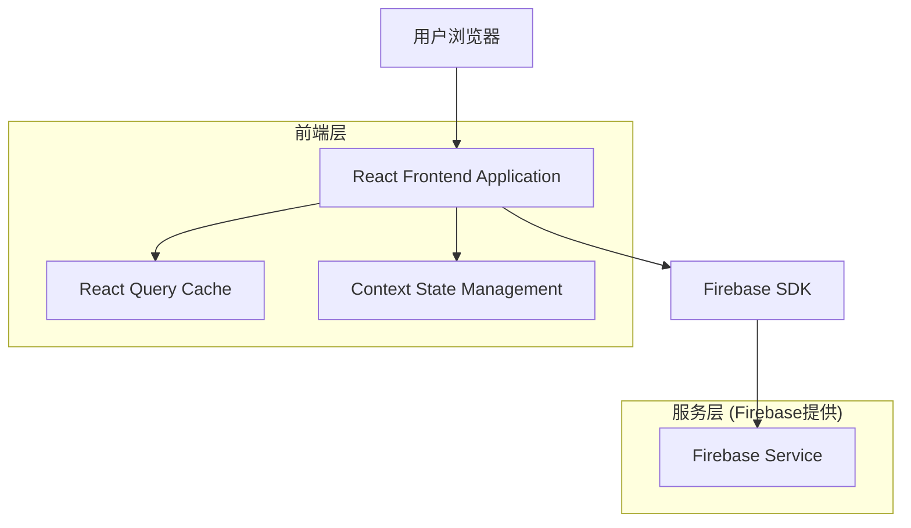
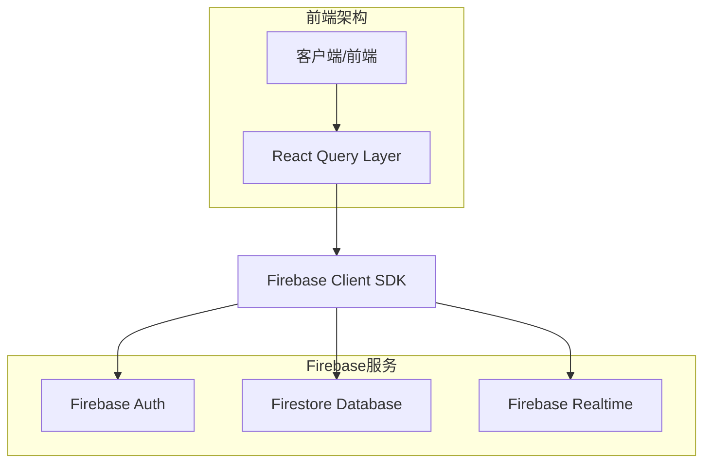
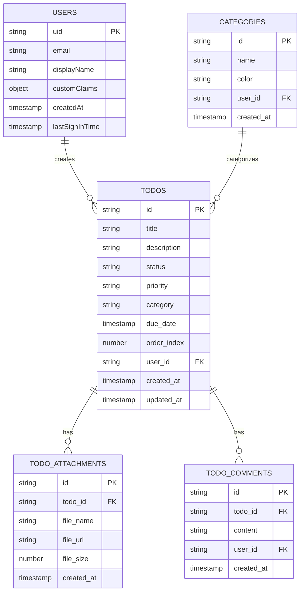

# TodoPage 技术架构文档

## 1. 架构设计



## 2. 技术描述

- 前端: React@18 + TypeScript + Material-UI@5 + React Query + React DnD + Vite
- 后端: Firebase (认证、Firestore数据库、实时监听)
- 状态管理: Context API + useReducer + React Query
- 样式: Material-UI + Emotion + 自定义主题

## 3. 路由定义

| 路由 | 目的 |
|------|------|
| /todos | TodoPage主页面，显示任务管理界面 |
| /todos/create | 快速创建任务页面 |
| /todos/:id | 任务详情页面（可选，用于深链接） |

## 4. API定义

### 4.1 核心API

**任务管理相关**

```typescript
// 任务数据类型
interface Todo {
  id: string;
  title: string;
  description?: string;
  status: 'pending' | 'in_progress' | 'completed';
  priority: 'low' | 'medium' | 'high';
  category?: string;
  due_date?: string;
  created_at: string;
  updated_at: string;
  user_id: string;
  order_index: number;
}

// 筛选参数
interface TodoFilters {
  status?: string[];
  priority?: string[];
  category?: string;
  search?: string;
  due_date_range?: {
    start?: string;
    end?: string;
  };
}

// 批量操作参数
interface BatchOperation {
  todo_ids: string[];
  operation: 'delete' | 'update_status' | 'update_category';
  data?: Partial<Todo>;
}
```

**Firebase Firestore 数据库操作**

```typescript
// 获取用户任务列表
const getTodos = async (userId: string, filters: TodoFilters) => {
  let query = collection(db, 'todos')
    .where('user_id', '==', userId)
    .orderBy('order_index', 'asc')
    .orderBy('created_at', 'desc');
  
  if (filters.status?.length) {
    query = query.where('status', 'in', filters.status);
  }
  if (filters.priority?.length) {
    query = query.where('priority', 'in', filters.priority);
  }
  
  const snapshot = await getDocs(query);
  return snapshot.docs.map(doc => ({ id: doc.id, ...doc.data() }));
};

// 创建新任务
const createTodo = async (todoData: Omit<Todo, 'id'>) => {
  const docRef = await addDoc(collection(db, 'todos'), {
    ...todoData,
    created_at: serverTimestamp(),
    updated_at: serverTimestamp()
  });
  return docRef.id;
};

// 批量更新任务状态
const batchUpdateTodos = async (todoIds: string[], updates: Partial<Todo>) => {
  const batch = writeBatch(db);
  todoIds.forEach(id => {
    const todoRef = doc(db, 'todos', id);
    batch.update(todoRef, { ...updates, updated_at: serverTimestamp() });
  });
  await batch.commit();
};

// 更新任务排序
const updateTodoOrder = async (todoId: string, orderIndex: number) => {
  const todoRef = doc(db, 'todos', todoId);
  await updateDoc(todoRef, {
    order_index: orderIndex,
    updated_at: serverTimestamp()
  });
};
```

## 5. 服务器架构图



## 6. 数据模型

### 6.1 数据模型定义



### 6.2 数据定义语言

**任务集合 (todos)**
```typescript
// Firestore 文档结构
interface TodoDocument {
  id: string; // 文档ID
  title: string;
  description?: string;
  status: 'pending' | 'in_progress' | 'completed';
  priority: 'low' | 'medium' | 'high';
  category?: string;
  due_date?: Timestamp;
  order_index: number;
  user_id: string;
  created_at: Timestamp;
  updated_at: Timestamp;
}

// 复合索引配置 (firestore.indexes.json)
{
  "indexes": [
    {
      "collectionGroup": "todos",
      "queryScope": "COLLECTION",
      "fields": [
        { "fieldPath": "user_id", "order": "ASCENDING" },
        { "fieldPath": "status", "order": "ASCENDING" },
        { "fieldPath": "order_index", "order": "ASCENDING" }
      ]
    },
    {
      "collectionGroup": "todos",
      "queryScope": "COLLECTION",
      "fields": [
        { "fieldPath": "user_id", "order": "ASCENDING" },
        { "fieldPath": "priority", "order": "ASCENDING" },
        { "fieldPath": "created_at", "order": "DESCENDING" }
      ]
    },
    {
      "collectionGroup": "todos",
      "queryScope": "COLLECTION",
      "fields": [
        { "fieldPath": "user_id", "order": "ASCENDING" },
        { "fieldPath": "due_date", "order": "ASCENDING" }
      ]
    }
  ]
}
```

**分类集合 (categories)**
```typescript
// Firestore 文档结构
interface CategoryDocument {
  id: string; // 文档ID
  name: string;
  color: string; // 默认 '#1976d2'
  user_id: string;
  created_at: Timestamp;
}

// 复合索引配置
{
  "collectionGroup": "categories",
  "queryScope": "COLLECTION",
  "fields": [
    { "fieldPath": "user_id", "order": "ASCENDING" },
    { "fieldPath": "name", "order": "ASCENDING" }
  ]
}
```

**附件集合 (todo_attachments)**
```typescript
// Firestore 文档结构
interface TodoAttachmentDocument {
  id: string; // 文档ID
  todo_id: string;
  file_name: string;
  file_url: string;
  file_size?: number;
  created_at: Timestamp;
}

// 复合索引配置
{
  "collectionGroup": "todo_attachments",
  "queryScope": "COLLECTION",
  "fields": [
    { "fieldPath": "todo_id", "order": "ASCENDING" },
    { "fieldPath": "created_at", "order": "DESCENDING" }
  ]
}
```

**评论集合 (todo_comments)**
```typescript
// Firestore 文档结构
interface TodoCommentDocument {
  id: string; // 文档ID
  todo_id: string;
  content: string;
  user_id: string;
  created_at: Timestamp;
}

// 复合索引配置
{
  "collectionGroup": "todo_comments",
  "queryScope": "COLLECTION",
  "fields": [
    { "fieldPath": "todo_id", "order": "ASCENDING" },
    { "fieldPath": "created_at", "order": "DESCENDING" }
  ]
}
```

**Firebase 安全规则 (firestore.rules)**
```javascript
rules_version = '2';
service cloud.firestore {
  match /databases/{database}/documents {
    // 任务集合安全规则
    match /todos/{todoId} {
      allow read, write: if request.auth != null && request.auth.uid == resource.data.user_id;
      allow create: if request.auth != null && request.auth.uid == request.resource.data.user_id;
    }
    
    // 分类集合安全规则
    match /categories/{categoryId} {
      allow read, write: if request.auth != null && request.auth.uid == resource.data.user_id;
      allow create: if request.auth != null && request.auth.uid == request.resource.data.user_id;
    }
    
    // 附件集合安全规则
    match /todo_attachments/{attachmentId} {
      allow read, write: if request.auth != null && 
        exists(/databases/$(database)/documents/todos/$(resource.data.todo_id)) &&
        get(/databases/$(database)/documents/todos/$(resource.data.todo_id)).data.user_id == request.auth.uid;
      allow create: if request.auth != null && 
        exists(/databases/$(database)/documents/todos/$(request.resource.data.todo_id)) &&
        get(/databases/$(database)/documents/todos/$(request.resource.data.todo_id)).data.user_id == request.auth.uid;
    }
    
    // 评论集合安全规则
    match /todo_comments/{commentId} {
      allow read, write: if request.auth != null && 
        exists(/databases/$(database)/documents/todos/$(resource.data.todo_id)) &&
        get(/databases/$(database)/documents/todos/$(resource.data.todo_id)).data.user_id == request.auth.uid;
      allow create: if request.auth != null && 
        exists(/databases/$(database)/documents/todos/$(request.resource.data.todo_id)) &&
        get(/databases/$(database)/documents/todos/$(request.resource.data.todo_id)).data.user_id == request.auth.uid;
    }
  }
}
```

**Firebase 认证配置**
```typescript
// Firebase 认证提供商配置
const authProviders = {
  email: true,
  google: true,
  github: false,
  anonymous: false
};

// 用户权限基于认证状态自动管理
// 只有认证用户可以访问自己的数据
// 匿名用户无法访问任何数据
```

**初始数据配置**
```typescript
// 用户首次登录时创建默认分类
const createDefaultCategories = async (userId: string) => {
  const defaultCategories = [
    { name: '工作', color: '#1976d2', user_id: userId, created_at: serverTimestamp() },
    { name: '个人', color: '#4caf50', user_id: userId, created_at: serverTimestamp() },
    { name: '学习', color: '#ff9800', user_id: userId, created_at: serverTimestamp() },
    { name: '购物', color: '#9c27b0', user_id: userId, created_at: serverTimestamp() }
  ];
  
  const batch = writeBatch(db);
  defaultCategories.forEach(category => {
    const categoryRef = doc(collection(db, 'categories'));
    batch.set(categoryRef, category);
  });
  await batch.commit();
};

// 创建示例任务
const createSampleTodos = async (userId: string) => {
  const sampleTodos = [
    {
      title: '完成项目文档',
      description: '编写技术文档和用户手册',
      status: 'pending',
      priority: 'high',
      category: '工作',
      user_id: userId,
      order_index: 0,
      created_at: serverTimestamp(),
      updated_at: serverTimestamp()
    },
    {
      title: '购买生活用品',
      description: '牛奶、面包、水果',
      status: 'pending',
      priority: 'medium',
      category: '购物',
      user_id: userId,
      order_index: 1,
      created_at: serverTimestamp(),
      updated_at: serverTimestamp()
    },
    {
      title: '学习React新特性',
      description: '了解React 18的新功能',
      status: 'in_progress',
      priority: 'medium',
      category: '学习',
      user_id: userId,
      order_index: 2,
      created_at: serverTimestamp(),
      updated_at: serverTimestamp()
    }
  ];
  
  const batch = writeBatch(db);
  sampleTodos.forEach(todo => {
    const todoRef = doc(collection(db, 'todos'));
    batch.set(todoRef, todo);
  });
  await batch.commit();
};
```

## 7. 组件架构设计

### 7.1 组件层次结构

```
TodoPage/
├── TodoDashboard/
│   ├── StatCard
│   ├── TodayFocus
│   └── QuickActions
├── TodoFilters/
│   ├── SearchInput
│   ├── FilterTags
│   └── SortOptions
├── TodoList/
│   ├── TodoCard
│   ├── BatchActionBar
│   └── VirtualScroll
├── QuickAdd/
│   ├── FloatingButton
│   └── InlineEditor
└── TodoSidebar/
    ├── TodoDetails
    └── QuickEdit
```

### 7.2 状态管理架构

```typescript
// 全局状态类型
interface TodoState {
  todos: Todo[];
  filters: TodoFilters;
  selectedTodos: string[];
  isLoading: boolean;
  error: string | null;
  viewMode: 'list' | 'grid' | 'kanban';
  sidebarOpen: boolean;
  selectedTodo: Todo | null;
}

// Action类型
type TodoAction =
  | { type: 'SET_TODOS'; payload: Todo[] }
  | { type: 'ADD_TODO'; payload: Todo }
  | { type: 'UPDATE_TODO'; payload: { id: string; updates: Partial<Todo> } }
  | { type: 'DELETE_TODO'; payload: string }
  | { type: 'SET_FILTERS'; payload: Partial<TodoFilters> }
  | { type: 'SET_SELECTED_TODOS'; payload: string[] }
  | { type: 'SET_LOADING'; payload: boolean }
  | { type: 'SET_ERROR'; payload: string | null }
  | { type: 'SET_VIEW_MODE'; payload: 'list' | 'grid' | 'kanban' }
  | { type: 'SET_SIDEBAR_OPEN'; payload: boolean }
  | { type: 'SET_SELECTED_TODO'; payload: Todo | null };
```

### 7.3 性能优化策略

- **React.memo**: 对TodoCard等频繁渲染的组件进行记忆化
- **useMemo**: 对筛选和排序逻辑进行记忆化
- **useCallback**: 对事件处理函数进行记忆化
- **虚拟滚动**: 使用react-window处理大量任务列表
- **代码分割**: 使用React.lazy对非关键组件进行懒加载
- **React Query**: 智能缓存和后台更新策略

这个技术架构文档为TodoPage的重新设计提供了详细的技术实现指导，确保高性能、可维护和可扩展的解决方案。