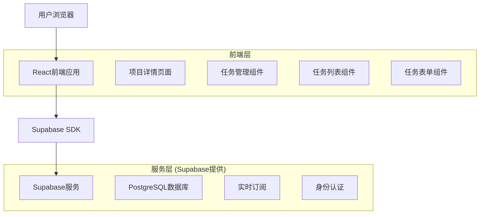
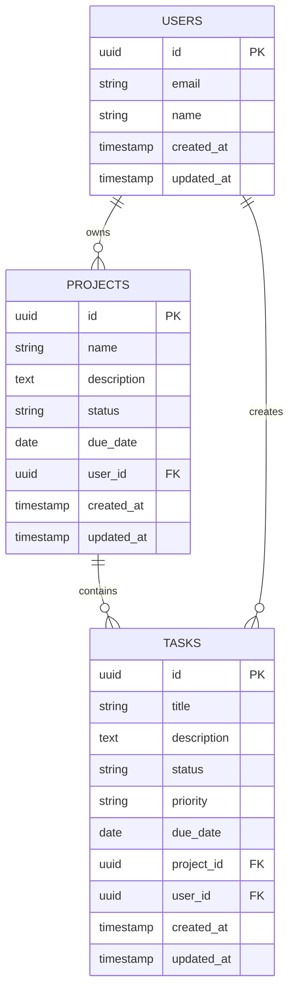

# 项目子任务功能技术架构文档

## 1. 架构设计



## 2. 技术描述

- 前端：React@18 + Material-UI@5 + TypeScript + Vite
- 后端：Supabase (PostgreSQL + 实时API + 身份认证)
- 状态管理：React Hooks + Context API
- 路由：React Router@6

## 3. 路由定义

| 路由 | 用途 |
|------|------|
| /projects | 项目列表页面，显示所有项目 |
| /projects/:id | 项目详情页面，显示项目信息和子任务列表 |
| /projects/:id/tasks/:taskId | 任务详情页面，显示单个任务的完整信息 |

## 4. API定义

### 4.1 核心API

**任务相关API**

获取项目的所有任务
```
GET /api/projects/:projectId/tasks
```

查询参数：
| 参数名称 | 参数类型 | 是否必需 | 描述 |
|----------|----------|----------|------|
| status | string | false | 任务状态筛选 (todo/in-progress/completed) |
| priority | string | false | 优先级筛选 (low/medium/high) |
| sortBy | string | false | 排序字段 (createdAt/dueDate/priority) |
| sortOrder | string | false | 排序方向 (asc/desc) |

响应：
| 参数名称 | 参数类型 | 描述 |
|----------|----------|------|
| tasks | Task[] | 任务列表 |
| total | number | 任务总数 |
| completed | number | 已完成任务数 |

创建新任务
```
POST /api/projects/:projectId/tasks
```

请求体：
| 参数名称 | 参数类型 | 是否必需 | 描述 |
|----------|----------|----------|------|
| title | string | true | 任务标题 |
| description | string | false | 任务描述 |
| priority | string | true | 优先级 (low/medium/high) |
| dueDate | string | false | 截止日期 (ISO格式) |
| status | string | false | 任务状态，默认为 'todo' |

示例：
```json
{
  "title": "设计用户界面",
  "description": "创建项目管理界面的原型设计",
  "priority": "high",
  "dueDate": "2024-02-15T10:00:00Z",
  "status": "todo"
}
```

更新任务
```
PUT /api/projects/:projectId/tasks/:taskId
```

请求体：与创建任务相同，所有字段可选

删除任务
```
DELETE /api/projects/:projectId/tasks/:taskId
```

## 5. 数据模型

### 5.1 数据模型定义



### 5.2 数据定义语言

**任务表 (tasks)**
```sql
-- 创建任务表
CREATE TABLE tasks (
    id UUID PRIMARY KEY DEFAULT gen_random_uuid(),
    title VARCHAR(255) NOT NULL,
    description TEXT,
    status VARCHAR(20) DEFAULT 'todo' CHECK (status IN ('todo', 'in-progress', 'completed')),
    priority VARCHAR(10) DEFAULT 'medium' CHECK (priority IN ('low', 'medium', 'high')),
    due_date TIMESTAMP WITH TIME ZONE,
    project_id UUID NOT NULL,
    user_id UUID NOT NULL,
    created_at TIMESTAMP WITH TIME ZONE DEFAULT NOW(),
    updated_at TIMESTAMP WITH TIME ZONE DEFAULT NOW()
);

-- 创建索引
CREATE INDEX idx_tasks_project_id ON tasks(project_id);
CREATE INDEX idx_tasks_user_id ON tasks(user_id);
CREATE INDEX idx_tasks_status ON tasks(status);
CREATE INDEX idx_tasks_priority ON tasks(priority);
CREATE INDEX idx_tasks_due_date ON tasks(due_date);
CREATE INDEX idx_tasks_created_at ON tasks(created_at DESC);

-- 设置行级安全策略
ALTER TABLE tasks ENABLE ROW LEVEL SECURITY;

-- 用户只能访问自己的任务
CREATE POLICY "Users can view own tasks" ON tasks
    FOR SELECT USING (auth.uid() = user_id);

CREATE POLICY "Users can insert own tasks" ON tasks
    FOR INSERT WITH CHECK (auth.uid() = user_id);

CREATE POLICY "Users can update own tasks" ON tasks
    FOR UPDATE USING (auth.uid() = user_id);

CREATE POLICY "Users can delete own tasks" ON tasks
    FOR DELETE USING (auth.uid() = user_id);

-- 授权
GRANT SELECT ON tasks TO anon;
GRANT ALL PRIVILEGES ON tasks TO authenticated;

-- 创建更新时间触发器
CREATE OR REPLACE FUNCTION update_updated_at_column()
RETURNS TRIGGER AS $$
BEGIN
    NEW.updated_at = NOW();
    RETURN NEW;
END;
$$ language 'plpgsql';

CREATE TRIGGER update_tasks_updated_at BEFORE UPDATE ON tasks
    FOR EACH ROW EXECUTE FUNCTION update_updated_at_column();

-- 初始化示例数据
INSERT INTO tasks (title, description, status, priority, project_id, user_id)
VALUES 
    ('设计数据库结构', '设计项目和任务的数据库表结构', 'completed', 'high', '00000000-0000-0000-0000-000000000001', auth.uid()),
    ('实现前端界面', '使用React和Material-UI创建用户界面', 'in-progress', 'high', '00000000-0000-0000-0000-000000000001', auth.uid()),
    ('编写API文档', '为任务管理功能编写详细的API文档', 'todo', 'medium', '00000000-0000-0000-0000-000000000001', auth.uid());
```

**更新项目表以支持进度计算**
```sql
-- 为项目表添加进度字段
ALTER TABLE projects ADD COLUMN IF NOT EXISTS progress INTEGER DEFAULT 0;
ALTER TABLE projects ADD COLUMN IF NOT EXISTS total_tasks INTEGER DEFAULT 0;
ALTER TABLE projects ADD COLUMN IF NOT EXISTS completed_tasks INTEGER DEFAULT 0;

-- 创建函数来计算项目进度
CREATE OR REPLACE FUNCTION calculate_project_progress(project_uuid UUID)
RETURNS VOID AS $$
DECLARE
    total_count INTEGER;
    completed_count INTEGER;
    progress_percentage INTEGER;
BEGIN
    -- 计算总任务数和已完成任务数
    SELECT COUNT(*) INTO total_count FROM tasks WHERE project_id = project_uuid;
    SELECT COUNT(*) INTO completed_count FROM tasks WHERE project_id = project_uuid AND status = 'completed';
    
    -- 计算进度百分比
    IF total_count > 0 THEN
        progress_percentage := ROUND((completed_count::FLOAT / total_count::FLOAT) * 100);
    ELSE
        progress_percentage := 0;
    END IF;
    
    -- 更新项目表
    UPDATE projects 
    SET 
        total_tasks = total_count,
        completed_tasks = completed_count,
        progress = progress_percentage,
        updated_at = NOW()
    WHERE id = project_uuid;
END;
$$ LANGUAGE plpgsql;

-- 创建触发器自动更新项目进度
CREATE OR REPLACE FUNCTION update_project_progress_trigger()
RETURNS TRIGGER AS $$
BEGIN
    -- 当任务被插入、更新或删除时，重新计算项目进度
    IF TG_OP = 'DELETE' THEN
        PERFORM calculate_project_progress(OLD.project_id);
        RETURN OLD;
    ELSE
        PERFORM calculate_project_progress(NEW.project_id);
        RETURN NEW;
    END IF;
END;
$$ LANGUAGE plpgsql;

CREATE TRIGGER tasks_progress_update_trigger
    AFTER INSERT OR UPDATE OR DELETE ON tasks
    FOR EACH ROW EXECUTE FUNCTION update_project_progress_trigger();
```