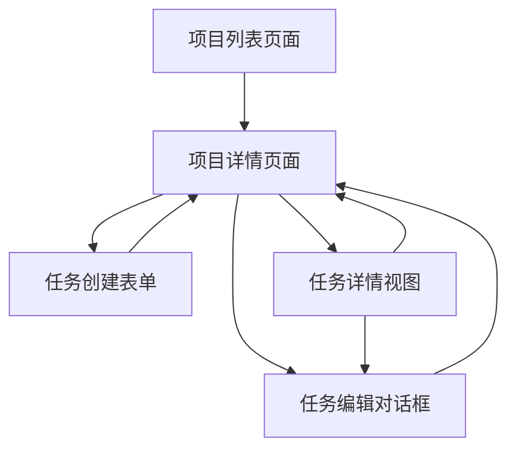

# 项目子任务功能需求文档

## 1. 产品概述

本功能旨在为现有的项目管理系统增加子任务管理能力，使用户能够在每个项目中创建、管理和跟踪多个子任务。通过细化项目为具体的可执行任务，提高项目管理的精细度和执行效率。

该功能将帮助用户更好地分解复杂项目，跟踪项目进度，并提供清晰的任务执行路径。目标是提升用户的项目管理体验和工作效率。

## 2. 核心功能

### 2.1 用户角色

| 角色 | 注册方式 | 核心权限 |
|------|----------|----------|
| 项目用户 | 现有用户系统 | 可创建、编辑、删除项目和子任务，查看项目进度 |

### 2.2 功能模块

我们的项目子任务功能包含以下主要页面：

1. **项目详情页面**：项目基本信息展示、子任务列表、项目进度统计
2. **任务管理界面**：任务创建表单、任务编辑对话框、任务状态切换
3. **任务详情视图**：任务完整信息展示、任务操作按钮

### 2.3 页面详情

| 页面名称 | 模块名称 | 功能描述 |
|----------|----------|----------|
| 项目详情页面 | 项目信息区域 | 显示项目名称、描述、状态、截止日期等基本信息 |
| 项目详情页面 | 进度统计区域 | 显示任务总数、已完成数量、进度百分比、状态分布图表 |
| 项目详情页面 | 子任务列表 | 展示所有子任务，支持筛选、排序、搜索功能 |
| 项目详情页面 | 快速操作栏 | 提供添加任务、刷新列表、返回项目列表等操作 |
| 任务管理界面 | 任务创建表单 | 输入任务标题、描述、优先级、截止日期、状态等信息 |
| 任务管理界面 | 任务编辑对话框 | 修改现有任务的所有属性，支持状态快速切换 |
| 任务管理界面 | 批量操作 | 支持批量删除、批量状态更新等操作 |
| 任务详情视图 | 任务信息展示 | 完整显示任务的所有属性和创建/更新时间 |
| 任务详情视图 | 任务操作区域 | 提供编辑、删除、状态切换、优先级调整等操作 |

## 3. 核心流程

**主要用户操作流程：**

1. 用户从项目列表页面点击项目卡片进入项目详情页面
2. 在项目详情页面查看项目基本信息和当前子任务列表
3. 点击"添加任务"按钮打开任务创建表单
4. 填写任务信息（标题、描述、优先级、截止日期）并保存
5. 在任务列表中查看、编辑或删除任务
6. 通过任务状态切换跟踪任务进度
7. 查看项目整体进度统计

## 4. 用户界面设计

### 4.1 设计风格

- **主色调**：延续现有系统的蓝紫色渐变主题（#667eea 到 #764ba2）
- **辅助色彩**：成功绿色（任务完成）、警告橙色（高优先级）、信息蓝色（进行中）
- **按钮样式**：圆角按钮，支持渐变背景和悬停效果
- **字体**：Roboto字体，标题使用较大字号，正文使用标准字号
- **布局风格**：卡片式布局，顶部导航，响应式设计
- **图标风格**：Material Design图标，简洁现代

### 4.2 页面设计概览

| 页面名称 | 模块名称 | UI元素 |
|----------|----------|--------|
| 项目详情页面 | 项目信息区域 | 渐变标题、状态徽章、描述文本、截止日期显示 |
| 项目详情页面 | 进度统计区域 | 进度条、统计卡片、圆形进度图、状态分布图表 |
| 项目详情页面 | 子任务列表 | 任务卡片、状态图标、优先级标签、操作按钮 |
| 任务管理界面 | 任务表单 | 输入框、下拉选择器、日期选择器、多行文本框 |
| 任务详情视图 | 任务信息 | 信息展示卡片、状态切换开关、操作按钮组 |

### 4.3 响应式设计

产品采用移动优先的响应式设计，支持桌面端和移动端的良好体验。在移动端使用全屏对话框进行任务编辑，桌面端使用模态对话框。任务列表在移动端采用单列布局，桌面端支持多列网格布局。